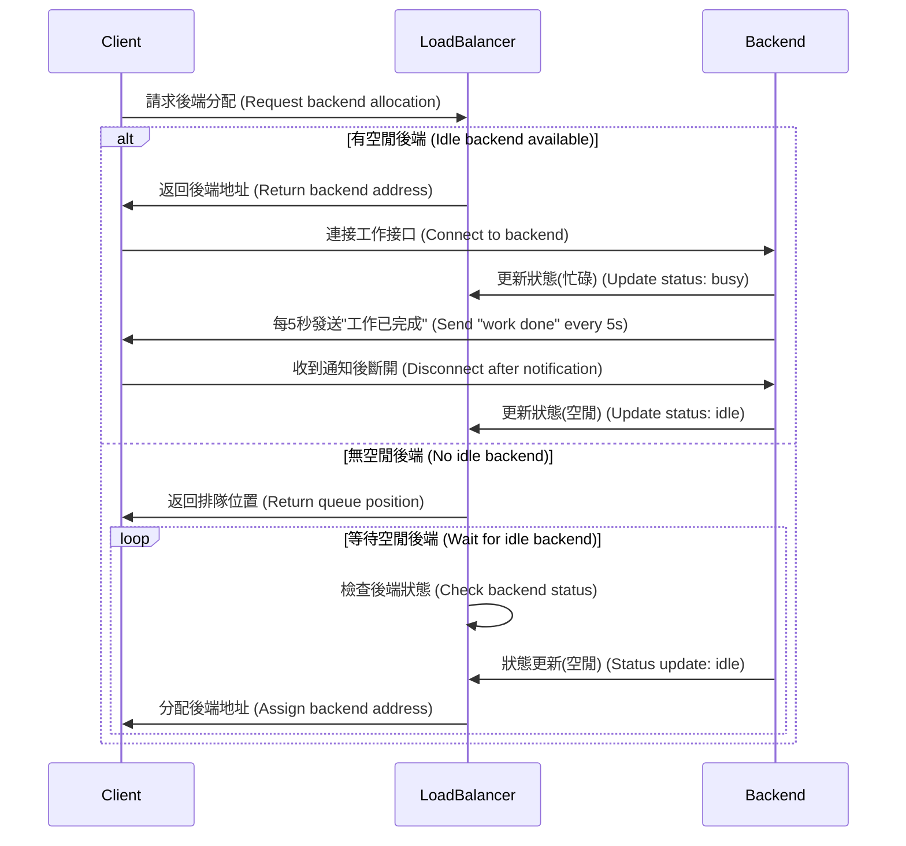

# IP Distributor / AI 服務分配系統

## 快速開始 (Quick Start)

1. 安裝依賴 (Install dependencies)

   ```
   npm install
   ```

2. 啟動負載均衡器 (Start Load Balancer)

   ```
   node server.js
   ```

3. 啟動後端服務 (Start Backend)

   ```
   node backend.js
   ```

   > 如需模擬多個後端，請複製 `backend.js` 為 `backend2.js`，並在 `backend.json` 裡添加對應配置，兩者設置需一致。  
   > To simulate multiple backends, copy `backend.js` to `backend2.js` and add corresponding config in `backend.json`. The settings must match.

4. 啟動前端客戶端 (Start Client)
   ```
   node client.js
   ```
   > 可多開 terminal 以模擬多個前端。  
   > You can open multiple terminals to simulate multiple clients.

---

## 工作流程 (Workflow)



---

## Swapping 與基於當前服務分配 (Swapping & Assign Based on Current Job)

### Swapping（動態切換服務）

- 當所有後端都無法直接滿足隊列中客戶端的服務需求時，系統會尋找「可交換」的空閒後端，發送 `swap_request` 指令，請其切換到所需服務。
- Swapping 會考慮後端的 `swap_cd`（冷卻時間），避免頻繁切換。
- 當後端準備切換時，會將對應客戶需求「抽起」暫存，轉換完成後立即向該客戶提供服務。
- 當後端完成切換後，會回報當前服務，負載均衡器再將其分配給等待中的客戶端。
- **目前 swap_cd（冷卻時間）是針對每臺後端機器設置，而非針對不同服務類型設置。**

> When no idle backend can directly serve a queued client, the system finds an idle and swappable backend, sends a `swap_request` to switch its service.  
> Swapping respects the backend's `swap_cd` (cooldown) to avoid frequent switching.  
> When a backend is about to switch, the corresponding client request is "held" and, after switching, the backend immediately serves that client.  
> After switching, the backend reports its new service, and the load balancer assigns it to the waiting client.  
> **Currently, swap_cd (cooldown) is set per backend machine, not per service type.**

### 基於當前服務分配 (Assign Based on Current Job)

- 負載均衡器會優先分配「當前已運行所需服務」且處於空閒狀態的後端給客戶端。
- 只有在沒有合適後端時，才會考慮 Swapping。
- 這樣可最大化資源利用率，減少不必要的服務切換。

> The load balancer first assigns idle backends already running the requested service.  
> Swapping is only considered if no suitable backend is available.  
> This maximizes resource utilization and minimizes unnecessary service switching.

---

## 配置說明 (Configuration)

- `backend.json` 定義所有後端節點、支持服務、端口、GPU 資訊等。
- 每個後端腳本（如 `backend.js`、`backend2.js`）需與配置文件對應。

---

## 文件說明 (File Overview)

- `server.js`：負載均衡器主程序 (Load balancer)
- `backend.js`：後端服務模擬 (Backend service)
- `client.js`：前端客戶端模擬 (Client)
- `backend.json`：後端節點配置 (Backend config)

---

## 進階 (Advanced)

- 支持無上限種 AI 服務。
- 支持動態服務切換（Swapping）。
- 支持隊列與實時狀態更新。
- 暫不支持熱修改 backend.json。

---

## 聯繫 (Contact)

如有問題請聯繫作者。  
For any questions, please contact the author.
